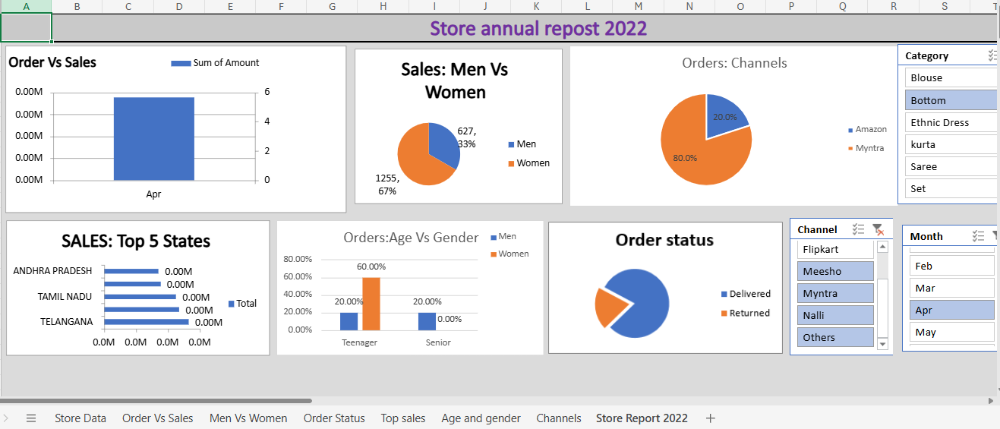

# 📊 Annual Sales Dashboard – Excel Data Analysis Project

## 🧾 Project Overview
This project presents an **interactive Microsoft Excel dashboard** developed to analyze and visualize **annual sales performance for the year 2022**. The dashboard transforms raw sales data into meaningful insights, enabling store owners and employees to monitor performance and make data-driven business decisions.

---

## 🎯 Business Objective
- Analyze yearly sales performance
- Identify high-performing customer segments
- Understand regional sales contribution
- Provide actionable recommendations to increase revenue

---

## 🛠️ Tools & Technologies Used
- Microsoft Excel
- Pivot Tables & Pivot Charts
- Data Cleaning & Transformation
- Slicers & Interactive Filters
- Data Visualization
- Dashboard Design

---

## 📊 Dashboard Features
✅ Interactive filters for dynamic analysis  
✅ Sales trend monitoring  
✅ Customer demographic insights  
✅ State-wise performance analysis  
✅ Platform-wise sales comparison  

---

## 📈 Key Insights
- Women customers aged **30–49 years** generated the highest sales.
- Top-performing states: **Maharashtra, Karnataka, and Uttar Pradesh**.
- E-commerce platforms such as **Amazon, Flipkart, and Myntra** contributed major order volume.
- Targeted promotions and discount campaigns improve conversions.

---

## 🧠 Business Recommendation
Target women customers aged 30–49 living in Maharashtra, Karnataka, and Uttar Pradesh using:
- Personalized advertisements
- Discount offers & coupons
- Promotions across Amazon, Flipkart, and Myntra

This strategy can help significantly improve store sales performance.

---

## 🖼️ Dashboard Preview

---

## 🚀 How to Use
1. Download the Excel file from this repository.
2. Open using Microsoft Excel (2016 or later recommended).
3. Use slicers and filters to explore insights interactively.

---

## 📌 Skills Demonstrated
- Data Cleaning
- Data Analysis
- Data Visualization
- Dashboard Development
- Business Intelligence
- Analytical Thinking

---

## 🔮 Future Improvements
- Power BI dashboard version
- Automated data refresh
- Predictive sales analysis using Python
- Customer segmentation using Machine Learning

---

## 👩‍💻 Author
**Your Name**  
Data Analyst | Data Science Enthusiast  
📧 manish9812806554@gmail.com
🔗 LinkedIn: [https://www.linkedin.com/in/manish-sharma-538559304](https://www.linkedin.com/in/manish-sharma-538559304)
